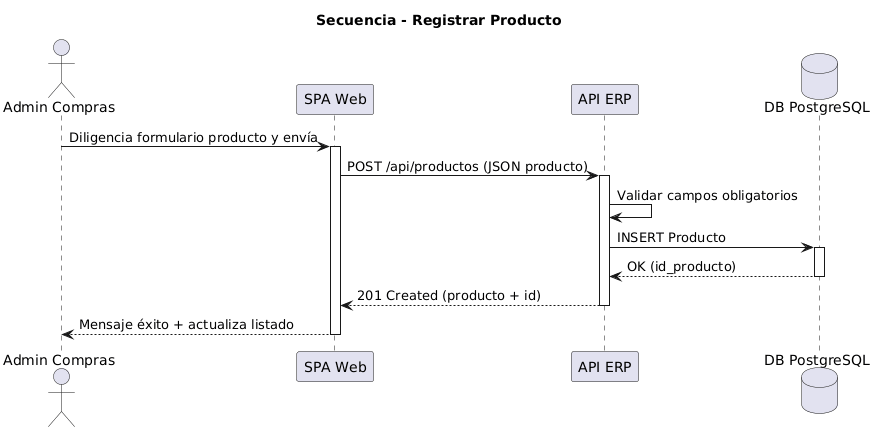

# 6. Vista de ejecución (runtime)

## Escenario: Registrar un producto
Flujo principal:
1. El administrador diligencia el formulario de producto en la SPA.
2. La SPA envía la solicitud a la API (POST /api/productos).
3. La API valida campos obligatorios y reglas básicas (p. ej., nombre no vacío, unicidad).
4. La API registra el producto en la base de datos.
5. La API responde éxito y la SPA actualiza el listado.

Fuente: elaboración propia
